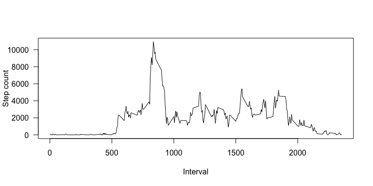
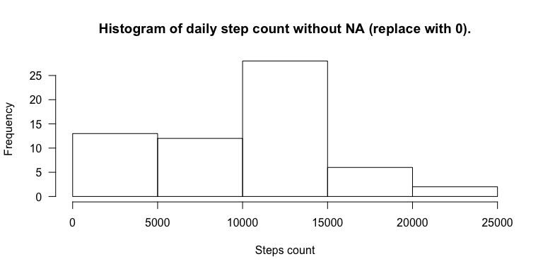

# Reproducible Research: Peer Assessment 1


## Loading and preprocessing the data

```r
# Read the zipped activity file into activity data frame.
activity <- read.csv(unz("/Users/ashwinrevo/Git/coursera/datasciencecoursera/RepData_PeerAssessment1/Activity.zip", "activity.csv"), header=TRUE)
library(dplyr)
```

```
## 
## Attaching package: 'dplyr'
## 
## The following objects are masked from 'package:stats':
## 
##     filter, lag
## 
## The following objects are masked from 'package:base':
## 
##     intersect, setdiff, setequal, union
```

## What is mean total number of steps taken per day?

```r
by_day_activity <- group_by(activity, date)
steps_per_day <- summarize(by_day_activity, steps_total=sum(steps, na.rm=TRUE))
par(mfrow=c(1,1), las=1)
hist(steps_per_day$steps_total, xlab="Steps count", ylab="Frequency", main="Histogram of daily step count")
```

 

```r
mean_steps_per_day <- mean(steps_per_day$steps_total)
median_steps_per_day <- median(steps_per_day$steps_total)
```


## What is the average daily activity pattern?

```r
by_interval_activity <- group_by(activity, interval)
steps_per_interval <- summarize(by_interval_activity, steps_total=sum(steps, na.rm=TRUE))
plot(steps_per_interval$interval, steps_per_interval$steps_total, type="l", xlab="Interval", ylab="Step count")
```

 

```r
x <- filter(steps_per_interval, steps_total==10927)
maximum_step_interval <- x$interval
```

## Inputing missing values

```r
sum_of_missing_na = sum(is.na(activity))
new_activity <- activity
new_activity[is.na(new_activity)] <- mean_steps_per_day # Replace missing values with mean for that day
by_day_new_activity <- group_by(new_activity, date)
new_steps_per_day <- summarize(by_day_new_activity, steps_total=sum(steps, na.rm=TRUE))
hist(new_steps_per_day$steps_total,  xlab="Steps count", ylab="Frequency", main="Histogram of daily step count without NA.")
```

 

```r
mean_steps_per_day <- mean(new_steps_per_day$steps_total)
median_steps_per_day <- median(new_steps_per_day$steps_total)
```

## Are there differences in activity patterns between weekdays and weekends?

```r
isweekend <- grepl("Sat|Sun", weekdays(as.Date(activity$date), abbr=TRUE))
activity<- cbind(activity, isweekend)
weekend_activity <- filter(activity, isweekend== TRUE)
weekday_activity <- filter(activity, isweekend== FALSE)
by_interval_activity_weekend <- group_by(weekend_activity, interval)
steps_per_interval_weekend <- summarize(by_interval_activity_weekend, steps_total=sum(steps, na.rm=TRUE))
plot(steps_per_interval_weekend$interval, steps_per_interval_weekend$steps_total, type="l", xlab="Interval", ylab="Step count in weekends")
```

 

```r
par(mfrow=c(1,1), las=1)
by_interval_activity_weekday <- group_by(weekday_activity, interval)
steps_per_interval_weekday <- summarize(by_interval_activity_weekday, steps_total=sum(steps, na.rm=TRUE))
plot(steps_per_interval_weekday$interval, steps_per_interval_weekday$steps_total, type="l", xlab="Interval", ylab="Step count in weekday")
```

 
